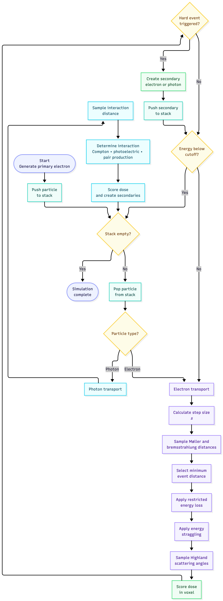
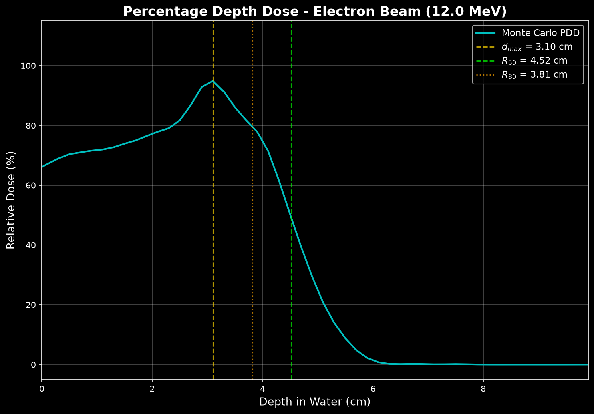
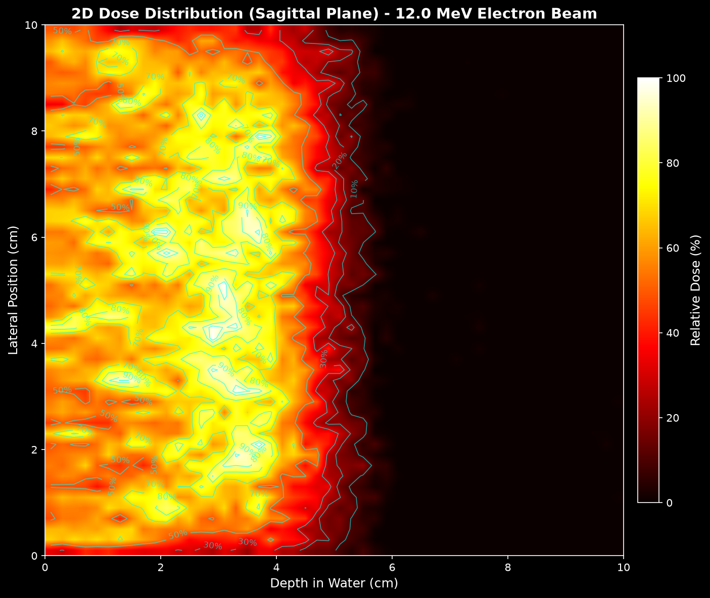

# ⚛️ Monte Carlo Electron Beam Dose Calculation

**A from-scratch simulation of how high-energy electron beams deposit dose inside a water phantom, using the Monte Carlo method — the same technique used in real hospital radiation therapy planning.**

---

## 📖 Table of Contents

- [What Is This Project?](#-what-is-this-project)
- [Algorithmic Methodology (Condensed History)](#-algorithmic-methodology-condensed-history)
- [Project Structure](#-project-structure)
- [File-by-File Breakdown](#-file-by-file-breakdown)
- [Sample Output Data](#-sample-output-data)
- [Getting Started](#-getting-started)
- [Glossary](#-glossary)

---

## 🎯 What Is This Project?

This project **simulates what happens when a beam of high-energy electrons hits a block of water**. In radiation therapy (used to treat cancer), doctors aim electron beams at tumors. To plan the treatment safely, they need to know exactly *where* and *how much* energy the electrons deposit inside the patient's body.

This code does exactly that — it tracks **100,000 individual electrons** one by one as they bounce around, lose energy, and eventually stop inside a virtual "water phantom" (a 10 cm × 10 cm × 10 cm cube of water that stands in for human tissue). At the end, it produces maps and graphs of the **dose distribution**.

---

## ⚙️ Algorithmic Methodology (Condensed History)

Monte Carlo methods represent the gold standard for radiation therapy dose calculation. Due to the high frequency of Coulomb interactions, tracking every individual atomic collision for an electron is computationally intractable. Therefore, this project implements a **Condensed History** approach, grouping millions of "soft" collisions into macroscopic steps while explicitly simulating "hard" discrete events (Møller scattering and Bremsstrahlung) based on stochastically sampled mean free paths.

### 1. The Event Loop
A primary electron (e.g., 12 MeV) is initialized at the surface of the voxelized water phantom ($Z=0$). The simulation enters a continuous `while` loop that tracks the particle's history until its energy drops below a predefined cutoff threshold (e.g., $10 \text{ keV}$). 

Below is the flowchart representing this architecture:



### 2. Competitive Step-Size Sampling
Before spatial translation occurs, the algorithm determines the `actual_step` distance by calculating four distinct constraints and selecting the minimum value:

1.  **Continuous Limit ($s$)**: To prevent unphysical macroscopic steps, a maximum step length is enforced. This ensures the electron does not lose more than a defined fraction (e.g., $3\%$) of its total energy continuously.
2.  **Geometric Boundary ($d_{boundary}$)**: Utilizing parametric ray-plane intersection, the 3D distance to the nearest $X, Y,$ or $Z$ voxel boundary is calculated using the electron's current direction cosines ($u, v, w$).
3.  **Møller Scattering ($s_{moller}$)**: The distance to the next hard electron-electron collision is sampled exponentially: 

$$ s_{moller} = -\lambda_{moller} \ln(R) $$

where $\lambda$ is the Mean Free Path and $R$ is a uniform random number between 0 and 1.

4.  **Bremsstrahlung ($s_{brem}$)**: The distance to the next hard photon emission event is sampled similarly: 

$$ s_{brem} = -\lambda_{brem} \ln(R) $$

The selected step size is $s_{step} = \min(s, d_{boundary}, s_{moller}, s_{brem})$. 

### 3. Continuous Energy Deposition
Once the step distance is established, the average continuous energy lost over that distance ($dE_{mean}$) is calculated using the **Restricted Stopping Power** and material density. To simulate quantum randomness, a Gaussian distribution (Bohr energy straggling) centered around $dE_{mean}$ is sampled to determine the final deposited energy ($dE$). This energy is immediately scored into the matrix of the electron's current voxel.

### 4. Multiple Coulomb Scattering and the "Random Hinge"
During the step, the electron undergoes numerous soft collisions causing angular deflection.
*   **The Highland Formula**: Calculates the Root Mean Square scattering angle ($\theta_{rms}$) based on the electron's energy and the step length:

$$ \theta_{rms} = \frac{13.6 \text{ MeV}}{\beta c p} \sqrt{\frac{\Delta s}{X_0}} $$

Where:
* **$\theta_{rms}$**: The root-mean-square of the projected scattering angle.
* **$\beta c$**: The velocity of the electron.
* **$p$**: The momentum of the electron.
* **$\Delta s$**: The path length (step size) the electron travels.
* **$X_0$**: The radiation length of the material.
*   **Stochastic Sampling**: Two orthogonal scattering angles ($\theta_x, \theta_y$) are sampled from a Gaussian distribution with standard deviation derived from $\theta_{rms}$. These are geometrically combined to yield the final polar ($\theta$) and azimuthal ($\phi$) scattering angles.
*   **The "Hinge" Displacement**: To accurately map the curved zigzag trajectory onto a linear grid, the simulation utilizes a mid-step hinge approximation. The spatial translation is calculated as an average of the pre-scatter vector $(u_{old}, v_{old}, w_{old})$ and the post-scatter vector $(u_{new}, v_{new}, w_{new})$, effectively simulating a curve.

### 5. Boundary Conditions & Range Rejection
To vastly improve computational efficiency, the algorithm compares the distance to the nearest voxel boundary ($d_{boundary}$) against the electron's **Continuous Slowing Down Approximation (CSDA) Range**. If $CSDA_{range} < d_{boundary}$, it is physically impossible for the electron to leave the current voxel. The simulation instantly terminates the transport loop for this electron, deposits all remaining kinetic energy into the current voxel, and proceeds to the next particle.

---

## 🏗 Project Structure

```
mc-electron-dose/
│
├── main.py                        # 🚀 Entry point — run this to start the simulation
├── config.py                      # ⚙️ All simulation settings (beam, phantom, transport)
├── requirements.txt               # 📦 Python dependencies
│
├── physics/                       # 🔬 THE PHYSICS ENGINE
│   ├── constants.py               #    Physical constants + NIST ESTAR data tables
│   ├── stopping_power.py          #    Energy loss calculations
│   ├── cross_sections.py          #    Interaction probabilities
│   └── scattering.py              #    Direction changes (Highland formula)
│
├── geometry/                      # 📐 THE VIRTUAL PATIENT (PHANTOM)
│   └── voxel_phantom.py           #    3D grid of water voxels
│
├── transport/                     # 🚂 THE PARTICLE TRACKER
│   ├── particle.py                #    Particle data structure
│   ├── simulation.py              #    Main simulation loop (orchestrator)
│   ├── electron_transport.py      #    Step-by-step electron tracking
│   └── photon_transport.py        #    Step-by-step photon tracking
│
├── scoring/                       # 📝 THE SCOREBOARD
│   └── dose_scorer.py             #    Accumulates energy deposits and computes dose
│
├── visualization/                 # 🎨 THE ARTIST
│   └── plot_dose.py               #    Generates all output plots
│
└── output/                        # 📁 SIMULATION RESULTS
    ├── depth_dose.png             #    Percentage depth dose curve
    ├── dose_2d_map.png            #    2D dose colormap
    └── dose_summary.csv           #    Raw numerical data
```

---

## 📄 File-by-File Breakdown

### `physics/stopping_power.py` — Energy Loss Calculator
Provides functions to look up stopping power values at any energy by **log-log interpolation** of the NIST tables.

### `physics/cross_sections.py` — Interaction Probabilities
Answers the question: **"How likely is each type of interaction?"** Uses Bethe-Heitler formulas for Bremsstrahlung and Møller cross sections for delta-ray production.

### `scoring/dose_scorer.py` — Statistical Uncertainty
Accumulates results and calculates the **statistical uncertainty** (Standard Error of the Mean) for each voxel using the variance of histories:

$$ s_{\bar{E}} = \sqrt{\frac{s^2}{N}} $$

Where:
* **$s_{\bar{E}}$**: The statistical uncertainty (Standard Error) of the average deposited energy in a voxel.
* **$s^2$**: The variance (how much the deposited energy fluctuated between different primary particles).
* **$N$**: The total number of particle histories simulated.

---

## 📊 Sample Output Data (100,000 Histories)

After running the simulation with a 12 MeV beam, the physics engine outputs standard clinical results:
- **$d_{max}$ (Peak Dose)** = 3.10 cm
- **$R_{50}$ (50% Dose Depth)** = 4.52 cm
- **$R_{80}$ (Therapeutic Range)** = 3.81 cm
- **Statistical Uncertainty** = ~14.5% (Scales as $1/\sqrt{N}$)

### 1. Central Axis PDD Data (`dose_summary.csv`)



This file traces the Percentage Depth Dose (PDD) curve down the central axis of the water phantom.

```csv
Depth (cm),PDD (%),Uncertainty (%)
0.10,65.86,15.69
0.30,69.59,15.59
0.50,71.45,15.33
0.70,69.94,15.47
0.90,72.70,15.49
1.10,71.29,14.95
1.30,71.99,14.78
1.50,75.08,14.76
1.70,73.84,14.70
1.90,76.65,14.47
2.10,78.95,14.50
2.30,77.56,14.33
2.50,80.92,13.68
2.70,84.42,13.46
2.90,95.92,12.49
3.10,100.00,12.31   <-- d_max (Peak Dose)
3.30,90.06,12.66
3.50,86.08,13.42
3.70,80.27,13.93
3.90,79.80,14.24
```

### 2. 3D Voxel Dose Map (`voxels_125k.csv`)



The simulation tracks all 125,000 independent voxels in the 3D grid. Below is a raw data sample showing the exact center of the beam (`ix=25, iy=25`) as it passes through various depth slices (`iz`).

```csv
ix,iy,iz,x_cm,y_cm,z_cm,energy_deposited_MeV,dose_pct,uncertainty_pct
25,25,10,5.1,5.1,2.1,8.166110,78.95,14.50
25,25,11,5.1,5.1,2.3,7.108748,77.56,14.33
25,25,12,5.1,5.1,2.5,5.997829,80.92,13.68
25,25,13,5.1,5.1,2.7,4.827987,84.42,13.46
25,25,14,5.1,5.1,2.9,4.331053,95.92,12.49
25,25,15,5.1,5.1,3.1,5.318154,100.0,12.31
25,25,16,5.1,5.1,3.3,6.195164,90.06,12.66
25,25,17,5.1,5.1,3.5,7.251475,86.08,13.42
25,25,18,5.1,5.1,3.7,8.950843,80.27,13.93
25,25,19,5.1,5.1,3.9,10.641464,79.80,14.24
```

---

## 🚀 Getting Started

### Install Dependencies
```bash
pip install -r requirements.txt
```

### Run the Simulation
```bash
python main.py --energy 12.0 --histories 100000
```

---

## 📜 Data Sources & References
- **Electron Stopping Powers**: [NIST ESTAR](https://physics.nist.gov/PhysRefData/Star/Text/ESTAR.html)
- **Photon Cross Sections**: [NIST XCOM](https://physics.nist.gov/PhysRefData/Xcom/html/xcom1.html)
- **Highland Formula**: V.L. Highland, *Nucl. Instrum. Methods* **129**, 497 (1975)

## 📝 License
This project is open-source and licensed under the MIT License.
